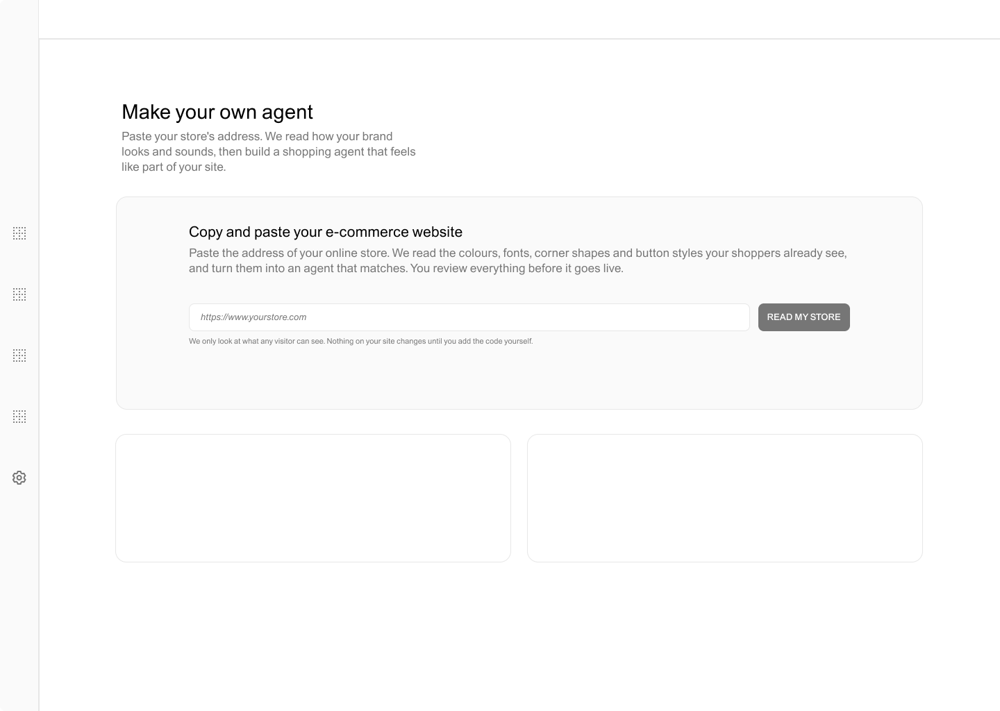
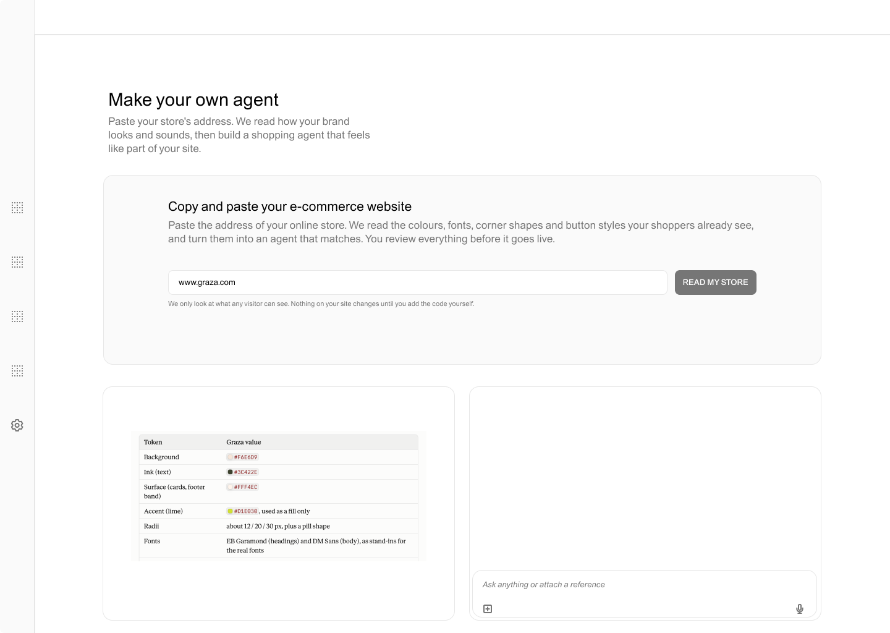

# DECISIONS

<aside>
👉

**Links**

- Live: [https://minimal-ai-takehome.vercel.app](https://minimal-ai-takehome.vercel.app/)
- Repo: [https://github.com/greatgreta/minimalAI-takehome](https://github.com/greatgreta/minimalAI-takehome)

**TL;DR**

- **The idea:** inheritance over configuration. The merchant pastes a store address, the configuration page reads the brand, and three plain-language questions finish the setup.
- **One agent, two brands:** Brand 1 (floating, speaks first, chips) and Brand 2 (docked, silent, strip above the composer) differ only by design and behaviour tokens, never by code.
- **Guarded by tests:** no brand values in the agent's code, random brand settings checked for readability, and a 375px check. The random test caught a real contrast bug.
- **Cut on purpose:** real AI, designing my own e-commerce, checkout and advanced settings. Conversations and the store reading are scripted. The token table and the snippet are real.
- **Weakest part:** everything was tuned on two brands. The store reading and the sliders are unproven on a third, and the demo shows the design and system thinking, not intelligence.

Greta Castellana Sep 21st, 2026

</aside>

## Merchant thinking and product considerations

- The merchant is not technical. So I:
    - automated the setup, so there is little to configure by hand;
    - designed the first minutes to deliver value within seconds, in a way that feels almost magical;
    - used plain English in both deliverables, the configuration page and the agent.
- The merchant wants a close brand match. So I:
    - aimed for an agent that feels native to the store. Matching colours, type and shape is the baseline, so I went further, into how the agent behaves (where it lives on the page, whether it speaks first) and how it speaks;
    - put strong focus on the tone of voice of the conversation.
- **Resolving the tension between a close match and a non-technical merchant.** My concept is *inheritance over configuration*. The merchant pastes their store address, the product reads the brand, and the merchant reviews the result and answers a few plain-language questions. Nobody needs to know a hex code to get an accurate match. (In this prototype the store reading is scripted, see "What I cut".)
- **What the merchant controls.** The merchant controls where the agent lives (floating or docked), whether it speaks first, and its vibe (calmer or louder). Everything else is inherited from their brand.
- **Designing for embedding.** The agent lives inside a page the merchant has spent a long time getting right. It has to look and behave as if it belongs there, or it becomes the problem the brief describes.
- **Assumption:** the agent has access to stock availability, delivery times and similar catalogue data.

## Building…

- **Two existing brands.** Because of time constraints, I used existing brands instead of creating an e-commerce site from scratch. I chose two with very different looks, customers and tone, and with plenty of SKUs, to give the agent options to work with (I ended up using only part of them). From here on I call them Brand 1 and Brand 2.
    
    
    |  | Brand 1 | Brand 2 |
    | --- | --- | --- |
    | Inspiration | [Graza](https://www.graza.co/), olive oil | [Maurten](https://www.maurten.com/), sports fuel |
    | Vibe | Loud, playful, hand-drawn, talks like a friend | Swedish-lab monochrome: white space, black type, no decoration. Speaks in grams of carbs and science |
    | Agent role | A chatty shop buddy. It opens with "Hey! Looking for an oil? Tell me what's cooking." | A coach. Terse, numbers first. It waits for the shopper, and its product cards read like spec sheets  |
    | Behaviour | Floating launcher, says hello first, shows what it understood as chips in the chat  | Docked panel, silent until asked, shows what it understood in a flat strip above the composer |
- **Same skeleton, different flavours.** One agent and one logic, rendered through design tokens and behaviour choices. Brand 1 and Brand 2 differ in look and in behaviour, and the agent has to feel true to both.
- **The shopper journey.** Each shopper opens with a message that carries at least two constraints, and the agent takes them to a confident choice. The journey ends at add to cart, on purpose: checkout is out of scope for now. Each flow includes a moment where things go wrong, and both work at 375px.
    - With Brand 1, the shopper arrives with a friend's recommendation, but once the agent asks what it's for, that product is not the right fit, so the agent pivots to a better one.
    - With Brand 2, the gel they need will not restock before their race, so the agent offers the closest in-stock option and explains the trade-off.
- **How I designed it.** I first worked through the conversations to define the constraints (for example, 375px wide), the happy path and the pivots. After brainstorming, I always build a visual artifact to help me think. I would refine it before sharing it with an engineer, but here it served as my building blocks: [https://claude.ai/artifact/LEKRZobdPntgg91SQJKxdS](https://claude.ai/artifact/LEKRZobdPntgg91SQJKxdS)

#### **Keeping the agent right across brands**

- Tone of voice makes an agent feel native or off-brand, so I spent a lot of time refining the scripted conversations. Brand 1 is informal and chatty. Brand 2 is snappy, factual and concise.
- Look and behaviour are tokens, not logic changes. Colour, type and shape are design tokens. Placement, whether the agent speaks first, and how it shows what it understood are behaviour tokens.
- Automatic tests guard this: no brand values in the agent's code, random brand settings checked for readability, and a 375px check. The random test caught a real bug (colours passed the contrast check before rounding but failed after), which is now fixed and covered by its own test.

#### **Configuration page**

- One screen: paste an address, watch the store being read, review the token table if needed, answer three questions in a non-technical conversation, copy the snippet. The reading and the chat are scripted. The table comes from the brand files, and the snippet is built by the real config codec, so the settings travel inside it and no backend is needed.
- **Font:** [ABC Areal](https://abcdinamo.com/typefaces/areal). I wanted flexibility with a typeface that has several weights and styles. It is a clean twist on Arial.

#### My approach to this assignment

*"Just make it exist first. You can make it good later."* I build a first version, then refine it in small steps.

1. **Sketch the skeleton** of what I want to build: a configuration page plus two agents on two e-commerce sites.
2. **Brainstorm with Claude and my own instinct** to refine what to build.
3. **Apply human judgement.** For example, two sites with two agents to show the difference, and scripted agents instead of real ones.
4. **Design the conversations** for both agents.
5. **Optimise build time by working in parallel.** I made a plan with Claude Code so it could start on the agents. While it built, I designed the configuration page in Figma and prepared the next build plan, going back and forth between Figma and Claude. I also handled the deliverables early: the deployed address, the permissions, and a first version of this document.
6. **Ship small, incremental improvements:** UI and UX iterations, bug fixes and refinements to the conversations.
7. **Deploy, fix permissions and finish documenting the decisions.**

## What I cut

- Building my own e-commerce site. Two existing brands let me focus on the configuration page and the agent experience.
- Real AI. All conversations (both agents and the configuration page) and the store reading are scripted. The token table and the snippet are real.
- Checkout. The journey ends when the shopper adds a product to the cart.
- Advanced settings (hex codes and font pickers, and any merchant control beyond placement, opening and vibe), a live preview on the configuration page, and manual setup.
- Shippability. I prioritised product decisions over production readiness. Nothing is tested on real merchant sites.

#### The weakest part

I tuned everything on two brands. The store reading and the energy and shape sliders are unproven on a third brand, and sliders cannot capture a brand's typographic voice. The conversations are scripted, so the demo shows the system and the design, not intelligence.

#### What my AI tooling suggested that I overrode, and why

I planned this with a few clear constraints, starting from an open brief. I did not keep a running log of every decision, so what follows is a snapshot of the Claude Code suggestions I overrode, mostly about design and interaction.

| What the AI suggested or did | What I did instead | Why |
| --- | --- | --- |
| A price question in the Brand 2 flow | Replaced it with a carbohydrate question, then merged it into one message | Price is not what this shopper compares, and the agent could answer it in one turn |
| Show what the agent understood in the same way on both brands | Chips in the conversation for Brand 1, a flat strip above the composer for Brand 2 | The brand sets how the agent shows its reasoning, not just how it looks |
| Vibe answer set energy 0.7 and shape 0.6 | Energy only, with shape kept neutral | Shape 0.6 changed the agent's corner radii, so they no longer matched the brand's |
| One shared shadow and corner radius for every brand | Square corners and a minimal shadow on Brand 2's launcher and panel | It should match Brand 2's clinical look |
| Generic launcher and title labels ("Ask", "Agent") | Labels in each brand's voice, such as a friendly "Chat with Olive" for Brand 1 and a plain, direct prompt for Brand 2 | Tone of voice is part of feeling native |
| An expand button on the panel, reported as working | Removed it | It did nothing, and a control that does nothing is worse than no control |
| A configuration page with quick-reply chips and a typewriter autofill | A fully scripted flow: prefilled address, prefilled replies, one action to start | The demo is deterministic, and it matches how the agent chats work |
| A pixel-diff loop to match unmeasurable design values | At most one pass, then report what is left | Time is better spent on the product than chasing small gaps |

## With more time

- Show the merchant a rough preview of the agent on their own e-commerce site, so they get a feel for it without embedding the snippet.
- Explore other triggers, so the shopper is not always the one who starts the conversation. The agent could start one after observing behaviour on the store, for example after a few clicks. This matters most for Brand 1, where the agent is a companion and the whole narrative is a friend who suggests the product.
- Explore voice commands, especially for Brand 1.
- Build a real, non-scripted agent.
- Think deeper about the technical constraints, to ground the solution in real feasibility.

Thank you for the extended deadline! I'd love to have opened the brief earlier to think about the approach, but I enjoyed every minute of building this. Looking forward to talking it through with you!