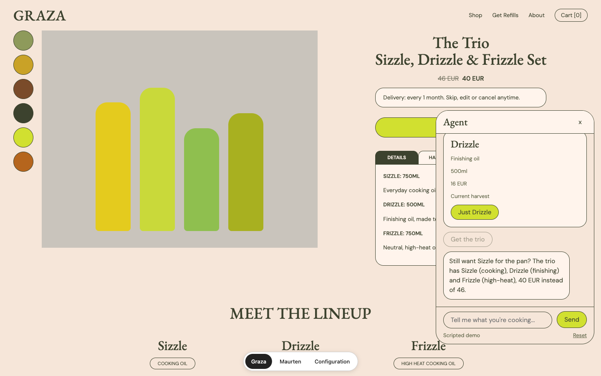
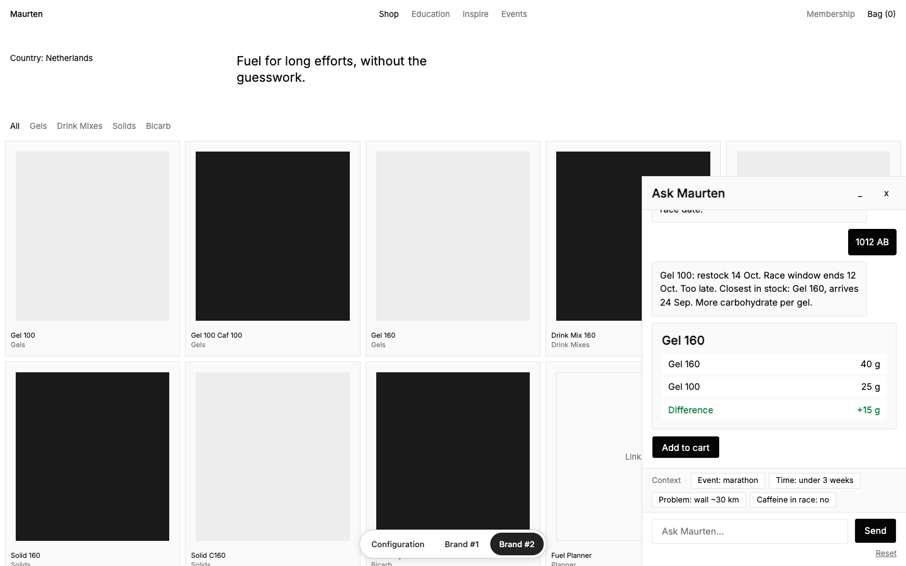

# Minimal AI take-home

Unaffiliated design exercise. Brand names and product data are used for a private take-home. Prices, offers and product data are fictional.




Mobile (375px): [Graza](docs/screens/store-graza-375.png) | [Maurten](docs/screens/store-maurten-375.png)

**Thesis: styled vs built.** One embeddable agent, two brands. Graza and Maurten look AND behave
differently (floating vs docked, greets vs silent, in-chat vs strip understanding) because their
*tokens* differ, never because the code forks.

## What this is

- `dist/agent.js`: one custom element (`<minimal-agent>`, open Shadow DOM) styled only through
  `--agent-*` CSS custom properties. Same code for every brand. Works at 375px.
- `/`: Graza store replica, loading the agent with the exact `<script>` a merchant would paste.
- `/maurten`: Maurten store replica, same agent, different tokens.
- `/configuration`: scripted page that reads a store and builds a snippet (see below).
- A neutral demo bar (bottom centre) switches between the three.
- A scripted, deterministic conversation per brand (no LLM): an opening message with at least two
  constraints, one obstacle, and an action at the end.

## Run

```bash
npm i
npm run dev       # dev server with clean URLs (see the note on /agent.js below)
npm run build     # builds the three pages and dist/agent.js (IIFE)
npm run preview   # serves the production build
npm test          # unit tests (Vitest)
npm run test:e2e  # Playwright 375px spec; needs Google Chrome and a prior build
npm run shots     # regenerates docs/screens/*.png; needs Google Chrome and a prior build
```

URLs: `/`, `/maurten`, `/configuration`, `/agent.js`.

In `npm run dev`, `/agent.js` is a small loader for the source entry, so the snippet's `data-config`
is not read there. Use `npm run build && npm run preview` to see exact merchant behaviour.

## Configuration page

`/configuration` walks a merchant through making an agent, built from two Figma screenshots. It is
scripted and deterministic, with no network:

- **Scripted:** the store reading (`readStore()` in `src/configuration/read-store.ts`, a stand-in for an
  extraction service) and the conversation (a pure state machine in `src/configuration/script.ts`).
- **Real:** the token table is read from the brand profile (`src/brands/profiles.ts` and the brand
  tokens), and the code snippet is built with the real `resolveTokens`, `encodeConfig` and
  `buildSnippet`, so pasting it into a page mounts the agent with those settings.
- Type is ABC Areal (`--cfg-font` in `src/configuration/styles.css` swaps it in one line).

The logic it drives lives in:

- `src/config/codec.ts`: `AgentConfig`, `encodeConfig` / `decodeConfig`, `resolveTokens`,
  `buildSnippet(config, origin)`
- `src/tokens/sliders.ts`: `applyEnergy`, `applyShape`
- `src/tokens/contrast.ts`: `guardContrast` (returns tokens plus a per-pair report)
- `<minimal-agent config="...">` re-resolves live when its `config` attribute changes

## Structure

```
src/tokens/     token schema, CSS emitter, OKLCH contrast guard, sliders
src/config/     AgentConfig codec + snippet builder (brand-blind)
src/brands/     brand token configs and packs (the only place brand values live, with tokens code)
src/catalogue/  fictional product data (every field verified:false)
src/agent/      the embeddable custom element, brain interface, components (brand-blind)
src/scripts/    deterministic per-brand conversations (copy with {placeholders})
src/hosts/      store replicas (brand values allowed here)
src/configuration/  the /configuration page (script, table, chat, styles)
src/demo-bar/   neutral demo navigation
vite/           dev/build plugins: clean URLs, snippet injection
tests/          unit tests, no-brand-leak, brand fuzz, Playwright 375px spec
docs/           graza-copy.md (verbatim source of the Graza script), screenshots
```

## Honest limits

- The agent is scripted. There is no LLM; `AgentBrain` is the interface an LLM brain would implement.
- The configuration page is scripted: it reads one fictional store and follows a fixed conversation.
- No backend. The postcode is checked in memory only and never stored or sent.
- Stores are replicas with flat colour blocks instead of imagery, with one exception: the Graza hero
  uses a real, third-party Graza product photo for this private exercise. One real Graza product photo
  is allowed, in the Graza replica hero only. No other brand photography anywhere.
- All product data is fictional and every field is marked `verified: false`.
- Brand fonts are licensed, so self-hosted stand-ins are used (EB Garamond and DM Sans, Inter).
